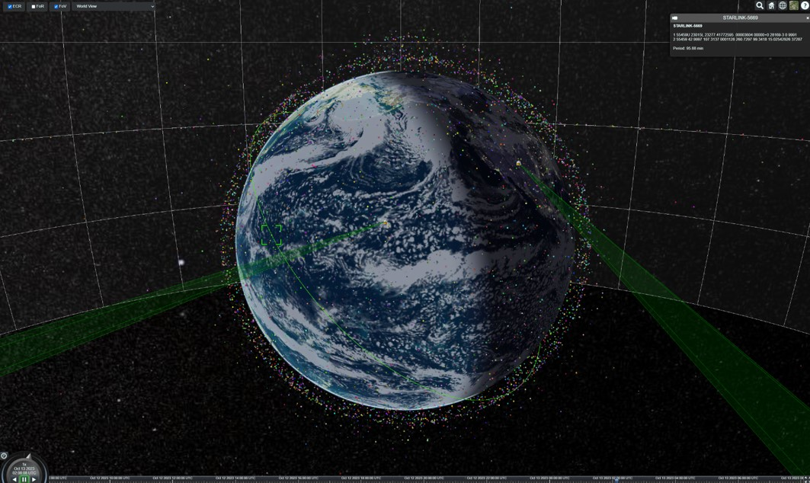

SatSim JS
=========

SatSim source code was developed under contract with ARFL/RDSM, and is approved for public release under Public Affairs release approval #AFRL-2022-1116.



## Installation from NPM

```sh
npm install satsim
```

## Usage

### NPM Installation (Recommended)

index.js

```javascript
import { Universe, createViewer } from "satsim";
import "cesium/Build/Cesium/Widgets/widgets.css";

const universe = new Universe();
const viewer = createViewer("cesiumContainer", universe);
```

index.html

```html
<!DOCTYPE html>
<html lang="en">
<head>
  <meta charset="utf-8">
</head>
<body>
  <div id="cesiumContainer"></div>
</body>
</html>
```

### CDN Usage

For quick prototyping or when you don't want to set up a build system, you can use the CDN version:

```html
<!DOCTYPE html>
<html lang="en">
<head>
    <meta charset="utf-8">
    <title>SatSim CDN Example</title>
    <meta name="viewport" content="width=device-width, initial-scale=1.0">
    <!-- SatSim CDN (includes Cesium) -->
    <script src="https://unpkg.com/satsim@latest/dist/satsim.js"></script>
    <link href="https://unpkg.com/satsim@latest/dist/Widgets/widgets.css" rel="stylesheet">
    <style>
        html, body, #cesiumContainer {
            width: 100%; height: 100%; margin: 0; padding: 0; overflow: hidden;
        }
    </style>
</head>
<body>
    <div id="cesiumContainer"></div>
    <script>
        // Set Cesium base URL for assets
        window.CESIUM_BASE_URL = 'https://unpkg.com/satsim@latest/dist/';
        
        // Create universe and viewer
        const universe = new SatSim.Universe();
        const viewer = SatSim.createViewer('cesiumContainer', universe);        
    </script>
</body>
</html>
```

**Note:** The CDN file is approximately 4.4MB as it includes the entire Cesium library. For production applications, we recommend using the NPM version with a proper build system for better optimization and code splitting.

## Example Webpack Application

```sh
git clone https://github.com/ssc-ai/satsimjs-example.git
cd satsimjs-example
npm install
npm start
```


## Example NextJS Application

```sh
git clone https://github.com/ssc-ai/satsimjs-nextjs-example.git
cd satsimjs-nextjs-example
npm install
npm run dev
```
